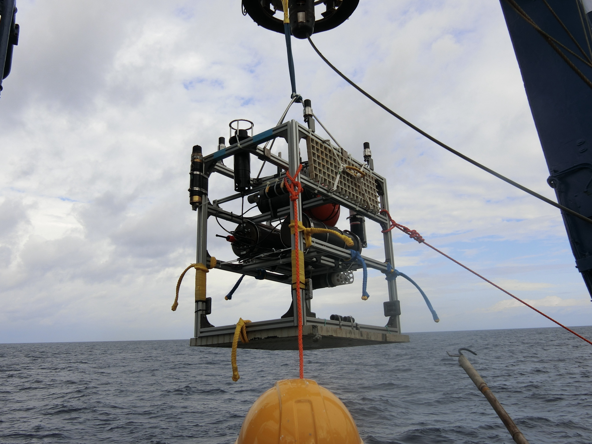

# Seafloor Station U-Tokyo
海底に設置して利用する水中ロボット  

## Description

[東京大学生産技術研究所巻研究室](http://makilab.iis.u-tokyo.ac.jp/)で開発された海底設置型の水中ロボットです。  
1. 自律移動する水中ロボットの位置出しの基準局として動作します  
2. CTD, pHなどのセンサを取り付けて定点での化学パラメータの計測を行います  

## 構成
- Raspberry Pi 2
- Ubuntu 14.04 armhf
- ROS indigo
- Python 2.7

## Usage

各パッケージのREADME参照

## Author

水島隼人，巻俊宏  

## License

MIT
