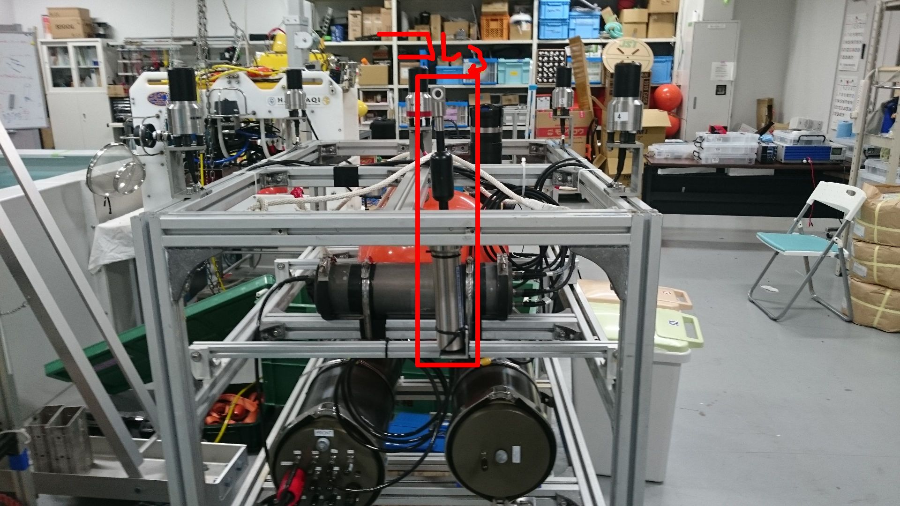

# INFINITY AEM-CAR-S13
有線式電磁流速計と通信して、データをROS topicで投げるプログラム  

## Description

流向流速情報をネットワークに投げる  
音速情報をネットワークに投げる  
音速に関しては温度しか取れてないので、決め打ちのsalinityを元に算出している。  
CTDセンサーがあれば、そちらの値を優先する(WaterDataのreliabilityがTrueが優先される)  

## Requirement

- ROS Indigo
- Python 2.7

## Usage

1. roscore
2. rosrun aem_car_s13 current.py

or

1. roslaunch aem_car_s13 current.launch

## Author

[Hayato Mizushima](https://twitter.com/hayato_m126)  
Toshihiro Maki  

## License

MIT
