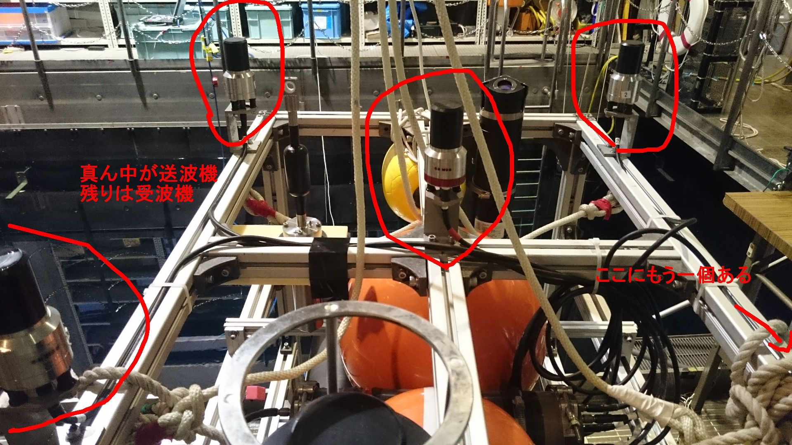

# AUV用音響通信測位システム ALOC
ALOCと通信して、データの送受信をして結果をROS topicで投げるプログラム  

## Description

4個の受波機への音の到来時間の差から音の到来方向を算出する  
自分から能動的に音を発信した場合は、往復の伝搬時間もわかるので、方向と距離を算出する。  
位置出しの他に、データ通信も行える。  
データ通信の内容の解釈はハイレベルプログラムで行う。ex) /station/station.py  

## Requirement

- ROS Indigo
- Python 2.7

## Usage

1. roscore
2. rosrun aloc aloc.py

or

1. roslaunch aloc aloc.launch

## Author

[Hayato Mizushima](https://twitter.com/hayato_m126)  
Takumi Matsuda  
Toshihiro Maki  

## License

MIT
