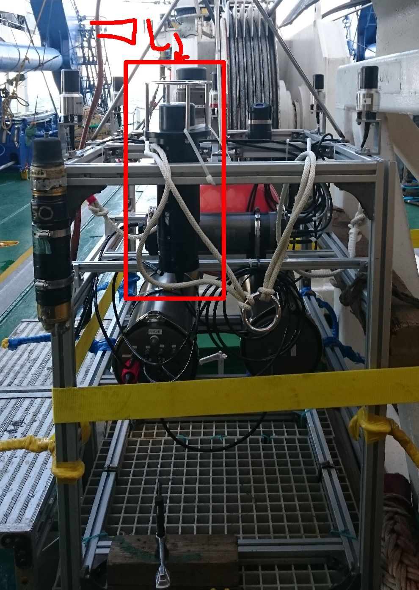

# Acoustic Modem ATM-926
TELEDYNE BENTHOS ATM-926を用いて、音響によるデータ通信を行う  

## Description

モデムに対して、シリアル通信で何か書き込むと、その文字列がモデムで送信される  
データ受信した場合は、受けったデータがシリアル通信上に吐かれる。  

ハイレベルのプログラムから受けとるとデータ送信を行う  
データ受信に対して何かの処理をしたい場合は、read_data()を回して、その中に処理を書く(TODO)  

## Requirement

- ROS Indigo
- Python 2.7

## Usage

    $ roscore
    $ rosrun atm926 modem.py
or

    $ roslaunch atm926 modem.launch

## Reference

http://teledynebenthos.com/product/acoustic_modems/920-series-atm-926

## Author

[Hayato Mizushima](https://twitter.com/hayato_m126)  
Toshihiro Maki  

## License

MIT
