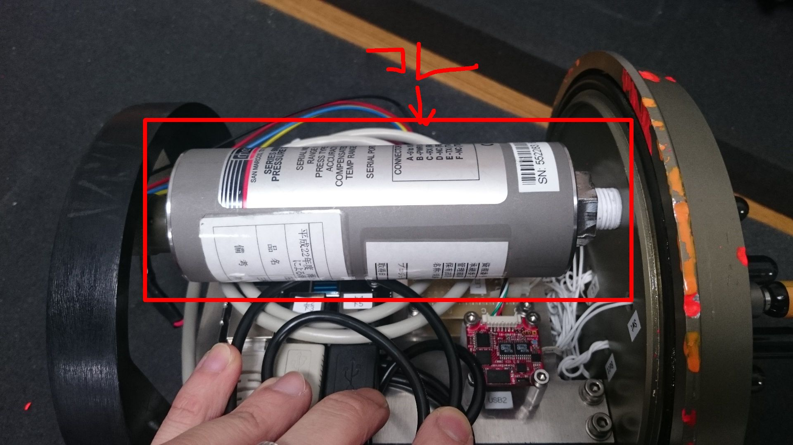

# Digital Pressure Transducer Series 6000
Menseor DPT-6000と通信して、データをROS topicで投げるプログラム  

## Description

海底ステーションの深度を取得して、ネットワークに投げる。  
pressure(raw data)を取得して、圧力から計算で深度を得る。  

/dev/Depthにエイリアスを張ってアクセスしている。  

## Requirement

- ROS Indigo
- Python 2.7

## Usage

    $ roscore
    $ rosrun dpt6000 depth.py
or

    $ roslaunch dpt6000 depth.launch

## Reference
http://www.sankyointernational.co.jp/sensa/aturyoku/pdf/4th_kouseido_atsuryoku_sensor_dpt_6000f_eng.pdf

## Author

[Hayato Mizushima](https://twitter.com/hayato_m126)  
Toshihiro Maki  

## License

MIT
