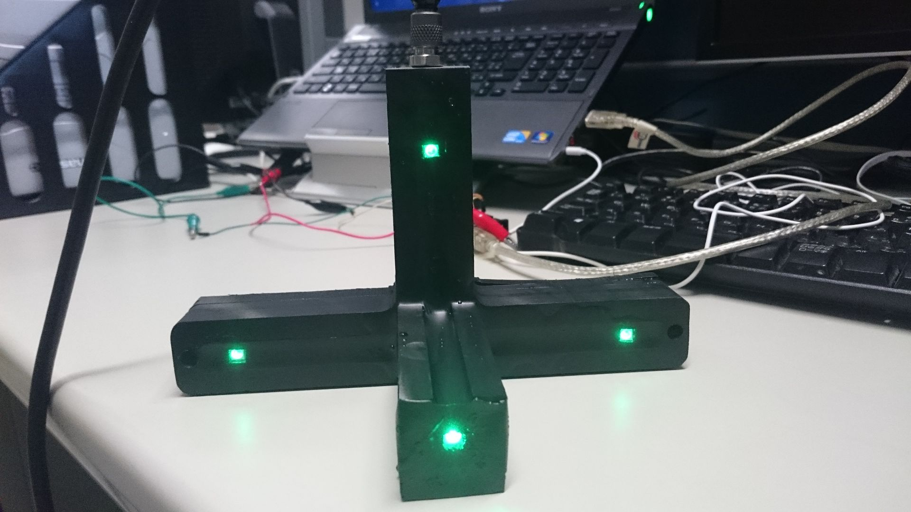

# LED Arduino
フルカラーLED NeopixelをROSからコントロール出来るようにしたプログラム  

Youtube demo movie  

## Description

水中における距離センサーとして利用する  
AUV側で画像処理によって、LEDの位置を抽出して距離を算出する  
水中における色の減衰を考えて緑色を使う  
ただし、浅海域では太陽光の影響で緑がサチってしまうこともあるので状況に併せて変える  

/ledにauv_msgs/LedData型のデータを投げると、LEDの色とON、OFFを調整できる  

## Requirement

- Arduino
- ROS Indigo
- Python 2.7
- rosserial_arduino
- rosserial_python
- [Adafruit NeoPixel Library](https://github.com/adafruit/Adafruit_NeoPixel)

## Usage
### Arduino側
    $ roscore
    $ rosrun rosserial_python serial_node.py _port:=/dev/ttyACM0  

Arduinoのデバイス名を確認しておくこと。

### ROS側
stationの中にあるset_ledを使って命令を投げる  

or

    $ rosrun rqt_ez_publisher rqt_ez_publisher  
で/ledに対して、LedDataのデータを作って投げる

## Installation
    $ cd ~/Arduino/libraries
    $ git clone https://github.com/adafruit/Adafruit_NeoPixel.git
    $ rosrun rosserial_arduino make_libraries.py .

少し古いArduino IDEを使っている場合は、$ cd ~/sketchbook/libraries  
以上を行った状態で、Arduino IDEを立ち上げてled_array.inoを書き込む

## Reference
https://learn.adafruit.com/downloads/pdf/adafruit-neopixel-uberguide.pdf

https://www.adafruit.com/datasheets/WS2812B.pdf

## Hardware
NC加工機を使って、塩ビ板を繰り抜いてLEDをエポキシ埋めしている。  
hardwareフォルダにCADデータと、NCデータを入れた。

## Author

[Hayato Mizushima](https://twitter.com/hayato_m126)  
Toshihiro Maki  

## License

MIT
