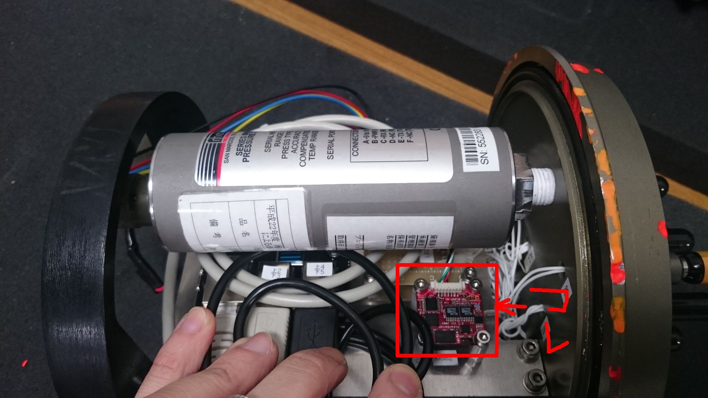

# OS5000
OceanServerの方位計OS5000と通信して、データをROS topicで投げるプログラム  

## Description

海底ステーションの姿勢を取得して、ネットワークに投げる。  
roll, pitch, heading, temperatureを取得出来る。  
取得する情報は初期設定で変更可能  

/dev/OceanServerにエイリアスを張ってアクセスしている。  

## Requirement

- ROS Indigo
- Python 2.7

## Usage

    $ roscore
    $ rosrun os5000 gyro.py
or

    $ roslaunch os5000 gyro.launch

## Reference
仕様書(絶対読む)  
http://www.ocean-server.com/download/OS5000_Compass_Manual.pdf

その他マニュアル類  
http://www.ocean-server.com/download.html

# キャリブレーション方法
シリアル通信ターミナルでポートを開く  
UbuntuではGtkTerm推奨  

1. \<ESC\>Cとタイプして  
2. 最低一周以上20秒以上かけて回す  
3. 最後にスペースを押して終わり  

## Author

[Hayato Mizushima](https://twitter.com/hayato_m126)  
Toshihiro Maki  

## License

MIT
