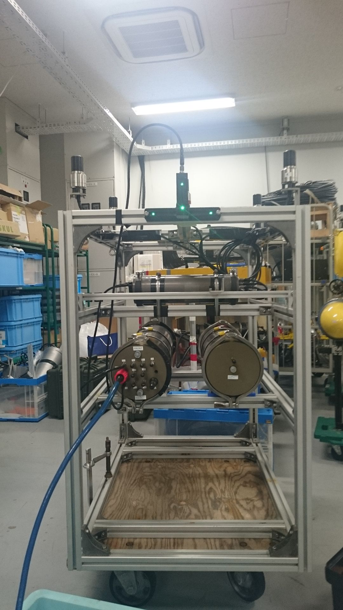

# 海底ステーション station
海底ステーションのハイレベルプログラム  

## Description

stationの頭脳の部分を担当する。  
alocの通信データの解釈と、送信データのセット  
モデムに音響通信の依頼をする。  
LEDオンオフと色の設定を行う。  
受け取った値の解釈や、応答データのセット等を行う  

## Requirement

- ROS Indigo
- Python 2.7

## Usage

1. roscore
2. rosrun station station.py

or

1. roslaunch station station.launch

## Author

[Hayato Mizushima](https://twitter.com/hayato_m126)  
Toshihiro Maki  

## License

MIT
